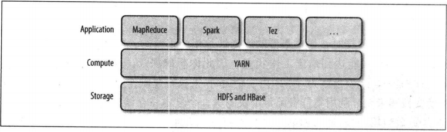
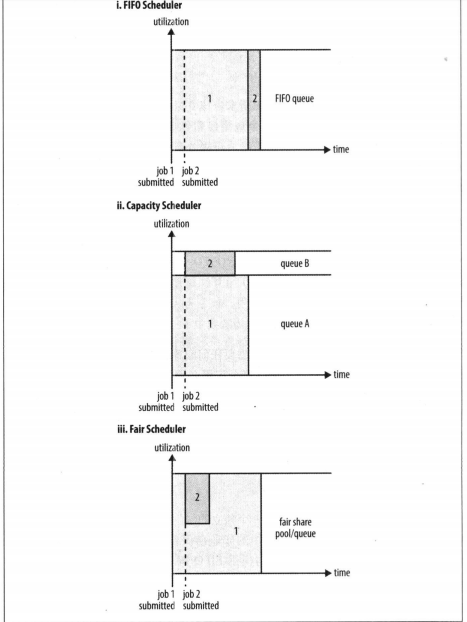

- [YARN](#yarn)
    - [YARN相对于MapReduce 1的优势](#yarn相对于mapreduce-1的优势)
    - [YARN的资源分配调度](#yarn的资源分配调度)
# YARN
- 概念:(Yet Another Resource Negotiator)是Hadoop的集群资源管理系统，于Hadoop 2.0引入，用于改善MR的实现。因足够强大的通用性，现作为一个Hadoop的管理平台
- 分层结构：
    
    - 可以看到YARN是作为中间层，连接应用如MR、Spark等计算引擎与底层存储层如HDFS、Hbase进行统一管理的平台地位。
    - 其他如Hive,Pig等则是建立在MR/Spark/Tez之上，在这里没有列出。

## YARN相对于MapReduce 1的优势
- 可扩展性：因为在MR1中，JobTacker需要同时管理作业和任务，而在YARN中将JobTracker分解成了资源管理器（Resource Manage）、application masterr、时间轴服务器。因而增强了扩展性。
- 可用性：承接上一点，因为拆分的粒度更小，因此高可用可以被分而治之。先为资源管理器提供高可用，其次再对YARN中每个应用提供
- 利用率：在MR1中使用的是slot（类似于JVM那种单位）；而在YARN中是采用资源池的方式。提高了资源的重复利用，再加上YARN本身执行的精细化管理。
- 平台化：除了MR以外，YARN还支持Spark等等。
- **总结一下：** YARN相对MR1，**将JobTrcker拆分成了三部分**，因此提高了可扩展性，并将高可用问题成功分治。在MR过程中**使用了资源池**，提高了资源的利用率。
## YARN的资源分配调度
- YARN的资源调度器：一共有三种，FIFO资源调度器、容量调度器和公平调度器。其中后两者支持**延迟调度**（优化原因类似于JAVA锁优化中的 _自旋锁_）
- FIFO调度器：一看名字就知道是最简单的调度器。以队列作为结构，依次为队列中的作业分配资源
    - 缺点：对小作业不友好，容易出现“饥饿”的情况。不适用与共享集群。
    - 优点：所有的FIFO实现最大的优点就是简单易实现。。。
- 容量调度器：在一开始配置的时候为每一个组织（任务）分配一定的资源比例。如下图为小作业任务分配了一个queueB的队列，那么小作业都会进入queueB而不用等待queueA中大作业的释放。**类似于银行排队的普通柜台和VIP柜台**。
- 优点：避免了小作业的长时间“饥饿”情况，并且支持弹性作业（就像VIP柜台一般没业务空闲，那么也会接待普通业务）
- 缺点：因为配置原因，多多少少会造成一定量的资源浪费。而且如果“弹性”的比例设的不够合适，可能会造成资源被过度挤占。就像VIP柜台一直被普通客户占用，假设VIP客户来了却不能服务的情况。
- 公平调度器：这个公平是资源分配上的公平，即按作业的数量平均分配资源。如下图，刚开始的时候只有A一个作业，那么它分配到所有的资源；后面进来一个小作业B，那么它们两个均分二分之一的资源。
- 优点：既能避免“饥饿”，又能得到较高的集群资源利用率。
- 缺点：新作业加入后，资源需要进行重新分配，会有一定时间的滞后延迟。
- 三种调度器集群利用图

