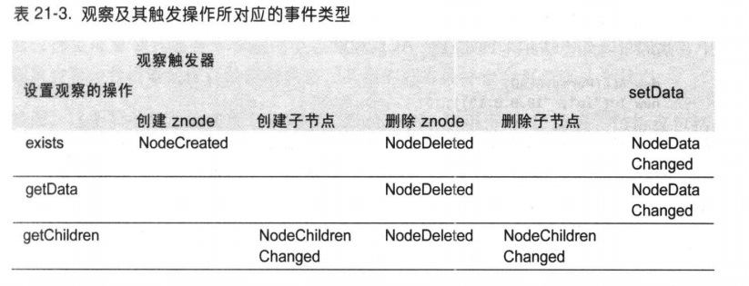

- [Zookeeper](#zookeeper)
    - [Zookeeper服务](#zookeeper服务)
        - [数据模型](#数据模型)
        - [操作](#操作)
        - [观察触发器（Watcher）](#观察触发器watcher)
        - [ACL](#acl)
    - [ZooKeeper核心实现](#zookeeper核心实现)
        - [领导者选举](#领导者选举)
# Zookeeper

- 关键词：**分布式、[选举机制](#领导者选举)、通知、高可用、Hadoop**

## Zookeeper服务

### 数据模型
- 概述：Zookeeper的特点之一是采用了一种精简的树状层次结构（文件目录式）并有一个与之关联的ACL（_访问控制列表_ Accessible-Controll-List）。被设计用于实现协调服务，通常使用小数据文件，因此与 **HDFS正好相反** ，一个znode存储数据被限制在1MB之内
- 特点：
    1. Zookeeper的数据访问具有原子性，包括读写操作。
    2. znode通过路径进行引用，但只支持绝对路径，都以'/'开头。其中/zookeeper是保留词不能使用，系统将其用来保存管理信息，例如配额。
- znode:分为短暂和持久型,可以在zk.create中使用CreateMode的四种枚举类型指定。
    1. 短暂型：无论任何原因导致连接断开，短暂型的znode节点都会被Zookeeper删除
        1. **短暂型znode不能拥有子节点**
        2. 可用于检测实时有哪些分布式资源可用（如果不可用那么短暂型的子节点会被删除）
    2. 持久型：**仅当客户端主动删除(不一定是创建它的客户端)**，持久的znde才会被删除
    3. 顺序号：znode可以在创建时设定顺序序号标识，是一个由父节点维护的单调递增值（即后创建的序号肯定比先创建的大）
        - 用途：
            1.  为所有的事件进行 **全局排序** ，客户端可以通过顺序号（sequence number）推断事件的顺兴圩
            2.  实现分布式共享
### 操作
1. zookeeper一共有9个操作，其中对数据的更新操作是有条件的（**delete/setData**），必须提供被更新znode的版本号（类似于MVCC，znode信息可以通过exists获得）。
2. 虽然说Zookeeper很像一个文件系统,但实际上它并不提供文件相关的查找、打开/关闭等操作
3. **Sync**().Zookeeper的读写操作虽然是原子性的，但是它 **并不保证数据的一致性**，因为网络传输，缓冲区等原因，一个客户端上的更新可能并不能立刻被 _看见_ ，需要使用sync方法（类似于volatile关键字解决的问题）来强制同步刷新数据。
4. **Multi()**:一个集合更新操作，相当于把对多个znode的操作封装为一个**原子操作**
5. **exists()**:可以获取znode的元数据，有四个重载方法
 其中两个是同步操作，返回类型为Stat，即znode的元数据信息
 ```
     public Stat exists(String path, Watcher watcher) throws KeeperException, InterruptedException {

 ```
而**所有的异步操作返回值都是void**，具体的数据通过**调用者传递的回调实现**通知给调用者。其中ctx可以是任意对象，主要用于供给客户端区分不同的请求。可以为null
```
    public void exists(String path, Watcher watcher, StatCallback cb, Object ctx) {

```
### 观察触发器（Watcher）
1. 前面提到的九种操作中，三种读操作： _exists,getData,getChildren_ 方法中都会传入一个Watcher类的实例，并在触发观察操作时由它回调。
2. exists对应的znode被 **创建、删除或数据更新时触发**
3. getData对应znode 被 **删除或数据更新时触发**，和exsits条件类似，但 **创建不会触发**，因为getData执行成功的前提是znode已经存在
4. getChildren对应的znode的 **一个子节点被删除、创建，或本身被删除**
5. 具体触发图:


### ACL
- 概述：Access-Controll-List，译名访问控制列表，实际是ZooKeeper提供对客户端身份验证机制，每个ACL都是身份验证方式、符合该方式的一个身份+一组权限的组合。一共有三种验证方式：
    1. digest:通过用户名+密码的方式来识别
    2. 通过客户端的IP地址
    3. sasl： 通过Kerberos来识别,流程类似于SSH
> Kerberos这一名词来源于希腊神话“三个头的狗——地狱之门守护者”系统设计上采用客户端/服务器结构与DES加密技术，并且能够进行相互认证，即客户端和服务器端均可对对方进行身份认证。可以用于防止窃听、防止replay攻击、保护数据完整性等场合，是一种应用对称密钥体制进行密钥管理的系统。支持SSO。
>
- ACL权限：除Admin（setACL）外共有5种权限，由Int定义，类似于Linux文件的权限，READ(1),WRITE(2)....一直到ALL（31），是2的幂次
```
  public interface Perms {
        int READ = 1;
        int WRITE = 2;
        int CREATE = 4;
        int DELETE = 8;
        int ADMIN = 16;
        int ALL = 31;
    }

```
1. ZooDefs.Ids中提供了三种预定义的ACL，分别是OPEN_ACL_UNSAFE（授予给所有人除Admin外的权限）；CREATOR_ALL_ACL（代表所有 **已认证** 的人除Admin外权限）； READ_ACL_UNSAFE（授予所有人读的权限）
```
ArrayList<ACL> OPEN_ACL_UNSAFE = new ArrayList(Collections.singletonList(new ACL(31, ANYONE_ID_UNSAFE)));
        ArrayList<ACL> CREATOR_ALL_ACL = new ArrayList(Collections.singletonList(new ACL(31, AUTH_IDS)));
        ArrayList<ACL> READ_ACL_UNSAFE = new ArrayList(Collections.singletonList(new ACL(1, ANYONE_ID_UNSAFE)));
```
## ZooKeeper核心实现
- 运行模式：一共有两种运行模式，分别是 **独立模式**、 **复制模式**
    1. 独立模式：类似于Hadoop布置的伪分布式。较为简单，适合于测试环境，但是不能保证高可用性
    2. 复制模式：一般情况下的工作模式，**ZooKeeper通过复制来实现高可用性** ，只要集群中有超过半数的机器能正常运转都能保证服务继续。即ZooKeeper要求每一个更改都被赋值到集群中超过半数的机器上，那么即便半数的机器出现故障，也 **至少有一台机器保证了最新的正确状态**，因此集群的机器数目一般是奇数
### 领导者选举
- 使用协议：Zab协议（注意，不是 _Paxos_ 协议），Zab新协议通过TCP协议提供的SEQ(sequence number-序列号)来保证接收消息的顺序
    1. 领导选举:集群中所有机器通过一个选择过程选出一台 _leader_ 机器，其他机器被称为 _follower_。一旦**半数以上的机器将状态与leader进行同步**，那么这个阶段就宣告完成。
    2. 原子广播：所有的 **写请求** 都会转发给 _leader_ ，再由 _leader_ 转发给其他的 _follower_。当半数以上的 _follower_ 将修改持久化之后，_leader_ 才会提交这个更新。这个过程类似于 **两段提交协议**